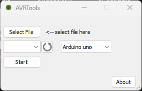
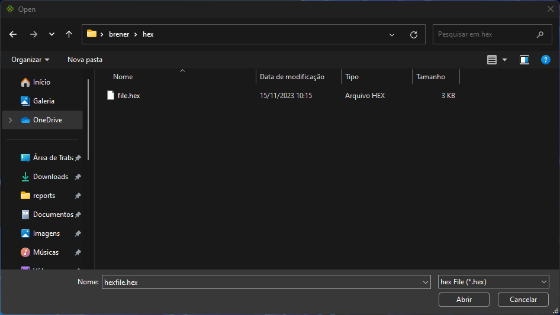
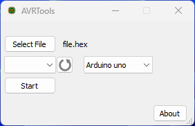
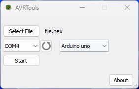
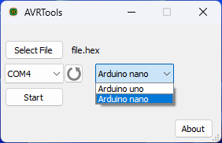
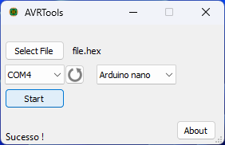

# AVRTools
Load hex file into the AVR microcontroller

# User Manual

Open program, click in "Select File" button:

    

    
    

Find in your device, select the correct file with extention ".hex" and click in open button

    

    
    

Confirme file selected.
If your development board is not plugged in, plug it in and click the update button to display the communication port in the list.

    

    
    
    

Select your board model, 

    

    
    

Click start and wait for the process to finish.

    

    
    

# About

Developer: Brener Pittner

Date last version: 11/2023

---

